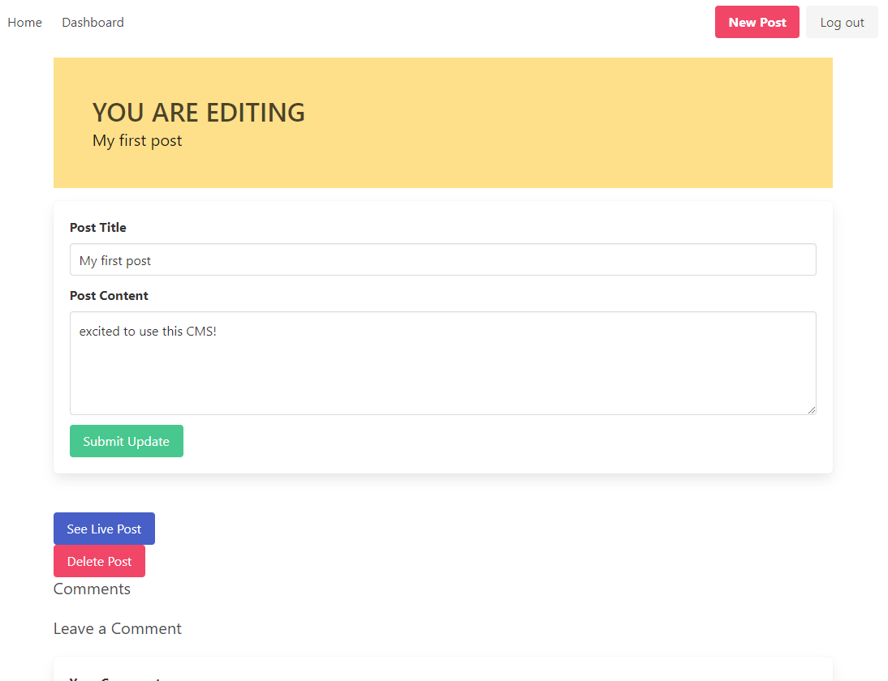

# MVC-CMS

  

  ## Description

  A simple Content Management System (CMS) built using the Model-View-Controller (MVC) paradigm, handlebars view engine and Bulma css framework.

  ### Deployed Link & Screenshot

  

  

  ## Table of Contents

  - [Installation](#installation)
  - [Usage](#usage)
  - [Credits](#credits)
  - [License](#license)
  - [Questions](#questions)

  ## Installation

  Use `npm i` and `npm run seed` to initialize the app.

  ## Usage

  Use `npm run start` to run the server.

  ## Credits

  University of Richmond Coding Bootcamp

  ## License
    
    This project is licensed under the MIT license.

  ## Questions

  - [GitHub User: Kurtmj93](https://github.com/Kurtmj93/)
  - Email: Kurtmj93@gmail.com